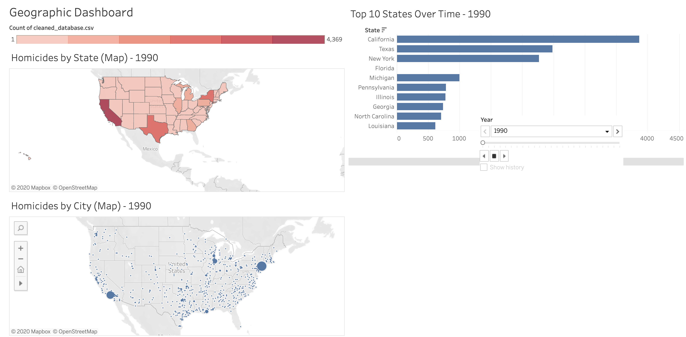
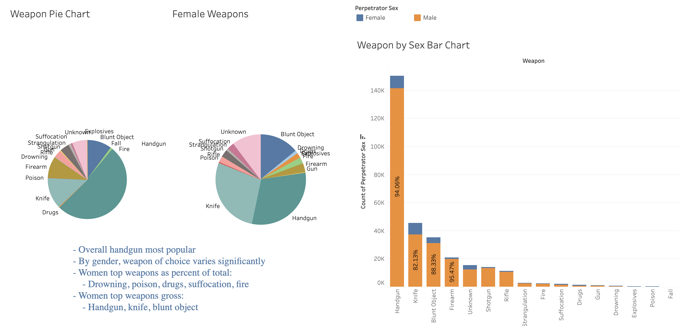
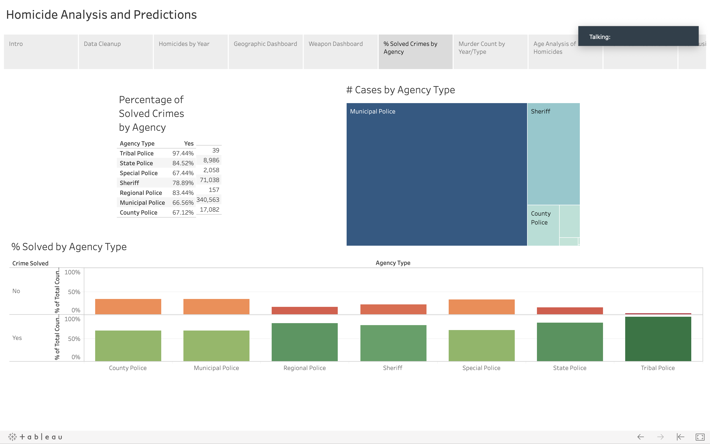
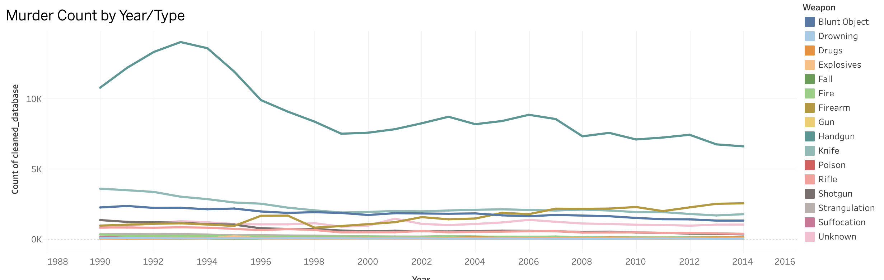
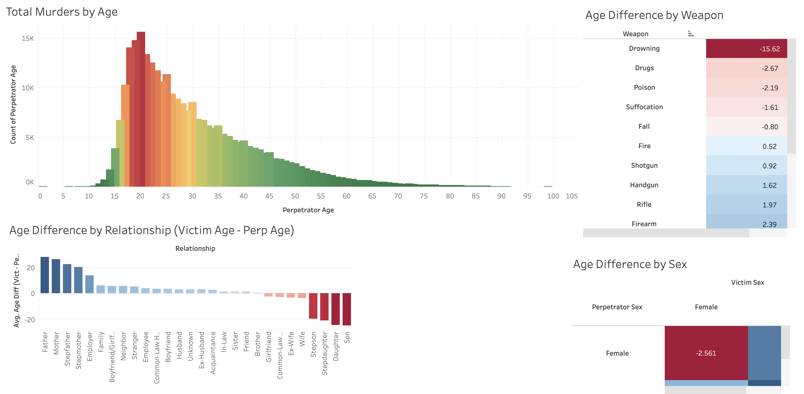
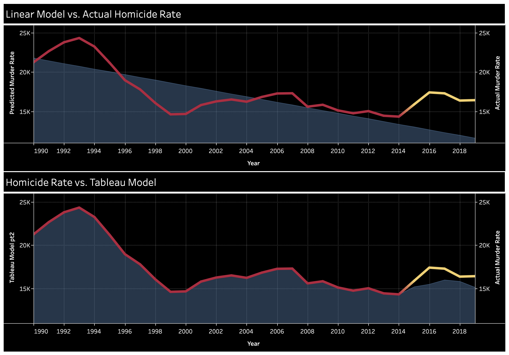

# Final Project: Homicide Analysis and Predictions
## Group Members: Mark Hirschenberger, Mary Whistler, Zach Herington, Catherine Smith

## Link to GitHub Pages
https://smithc6136.github.io/final_project/HTML/index.html

## Chosen Topic and Rationale
Homicide Reports 1990-2014

We were looking to get a better understanding of homicide trends in the United States. Most people have an idea of the crime rate based off of anecdotal evidence, but we wanted to see what has occurred over time and where we see it going in the future.

## Key Tools
Python (pandas, sklearn), Tableau, HTML/CSS

## Description of and Link to Data
https://www.kaggle.com/murderaccountability/homicide-reports

"The Murder Accountability Project is the most complete database of homicides in the United States currently available. This dataset includes murders from the FBI's Supplementary Homicide Report from 1976 to the present and Freedom of Information Act data on more than 22,000 homicides that were not reported to the Justice Department. This dataset includes the age, race, sex, ethnicity of victims and perpetrators, in addition to the relationship between the victim and perpetrator and weapon used."

## Inspiration
Predictive Policing: The Future of Law Enforcement
* https://cloudblogs.microsoft.com/industry-blog/government/2016/03/03/predictive-policing-the-future-of-law-enforcement/

## Outline of Final Design
Pandas - clean data and perform basic analysis

Tableau - visualizations

Machine Learning - project homicide rates 2015-2019

